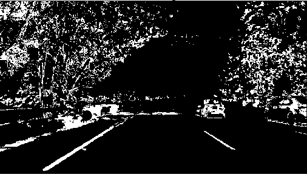
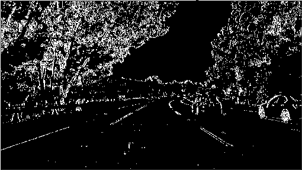
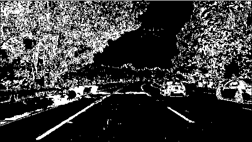

## Advanced Lane Finding

In this project, your goal is to write a software pipeline to identify the lane boundaries in a video, but the main output or product we want you to create is a detailed writeup of the project.  Check out the [writeup template](https://github.com/udacity/CarND-Advanced-Lane-Lines/blob/master/writeup_template.md) for this project and use it as a starting point for creating your own writeup.  

Creating a great writeup:
---
A great writeup should include the rubric points as well as your description of how you addressed each point.  You should include a detailed description of the code used in each step (with line-number references and code snippets where necessary), and links to other supporting documents or external references.  You should include images in your writeup to demonstrate how your code works with examples.  

All that said, please be concise!  We're not looking for you to write a book here, just a brief description of how you passed each rubric point, and references to the relevant code :).

You're not required to use markdown for your writeup.  If you use another method please just submit a pdf of your writeup.

The Project
---

The goals / steps of this project are the following:

* Compute the camera calibration matrix and distortion coefficients given a set of chessboard images.
* Apply a distortion correction to raw images.
* Use color transforms, gradients, etc., to create a thresholded binary image.
* Apply a perspective transform to rectify binary image ("birds-eye view").
* Detect lane pixels and fit to find the lane boundary.
* Determine the curvature of the lane and vehicle position with respect to center.
* Warp the detected lane boundaries back onto the original image.
* Output visual display of the lane boundaries and numerical estimation of lane curvature and vehicle position.

The images for camera calibration are stored in the folder called `camera_cal`.  The images in `test_images` are for testing your pipeline on single frames.  If you want to extract more test images from the videos, you can simply use an image writing method like `cv2.imwrite()`, i.e., you can read the video in frame by frame as usual, and for frames you want to save for later you can write to an image file.  

To help the reviewer examine your work, please save examples of the output from each stage of your pipeline in the folder called `ouput_images`, and include a description in your writeup for the project of what each image shows.    The video called `project_video.mp4` is the video your pipeline should work well on.  

The `challenge_video.mp4` video is an extra (and optional) challenge for you if you want to test your pipeline under somewhat trickier conditions.  The `harder_challenge.mp4` video is another optional challenge and is brutal!

If you're feeling ambitious (again, totally optional though), don't stop there!  We encourage you to go out and take video of your own, calibrate your camera and show us how you would implement this project from scratch!

Compute the camera calibration matrix and distortion coefficients given a set of chessboard images.
-----

# Do camera calibration given object points and image points

A camera is an optical instrument for capture 2D images of 3D objects in real world. The capture process causes image distortions based on camera parameters(i.e. intrinsics, extrinsics, and distortion coefficients). Chessboard is used to estimate the camera parameters, because Chessboard corners are easily detectable feature points.

The cv2.calibrateCamera function estimates the intrinsic camera parameters and extrinsic parameters for each of the views. The coordinates of 3D object points and their corresponding 2D projections in each view must be specified.

The coordinates of 3D object points：
we can say chess board was kept stationary at XY plane, (so Z=0 always) and camera was moved accordingly.

The corresponding 2D projections:
The function cv2.findChessboardCorners can find the positions of internal corners of the chessboard.

Camera Matrix - a matrix describes the mapping from 3D points in the world to 2D points in an image. The result is as below:

[[  1.15396093e+03   0.00000000e+00   6.69705359e+02]
 [  0.00000000e+00   1.14802495e+03   3.85656232e+02]
 [  0.00000000e+00   0.00000000e+00   1.00000000e+00]]

Distortion coefficients -
\*radial distortion, straight lines will appear curved
\*tangential distortion, image may look nearer than expected

In short, there are five parameters, known as distortion coefficients. The result is as below:

[[ -2.41017968e-01  -5.30720497e-02  -1.15810318e-03  -1.28318544e-04
    2.67124303e-02]]

## Apply a distortion correction to raw images.

The cv2.undistort() function removes image distortion using camera matrix and distortion coefficients from the cv2.calibrateCamera function. The result is as below:

<table border="1">
<tr>
<td>Original</td>
<td>Undistorted</td>
</tr>
<tr>
<td></td>
<td></td>
</tr>
</table>

<table border="1">
<tr>
<td>Original</td>
<td>Undistorted</td>
</tr>
<tr>
<td></td>
<td></td>
</tr>
</table>

## Use color transforms, gradients, etc., to create a thresholded binary image.
### color transforms

### Threshold x gradient
The cv.Sobel function can calculate a directional change (image gradient) in intensity or color based on the first order derivatives. Taking the gradient in the x direction emphasizes edges closer to vertical. Alternatively, taking the gradient in the y direction emphasizes edges closer to horizontal.

### S channel (HLS space)
Red-green-blue（RGB) color space can be transformed into Hue-lightness-saturation(HLS) color space. HLS space help detect lane lines of different colors and under different lighting conditions. Compared to H and L channels, S channel is more robust to detect different colors of lane lines under varying degrees of daylight and shadow.

### Combining Thresholds
The output is shown below. The final image color_binary is a combination of binary thresholding the S channel (HLS) and binary thresholding the result of applying the Sobel operator in the x direction on the original image.

<table border="1">
<tr>
<td>Original</td>
<td>Threshold x gradient</td>
</tr>
<tr>
<td></td>
<td></td>
</tr>
<tr>
<td>Threshold saturation</td>
<td>Combining Thresholds</td>
</tr>
<tr>
<td></td>
<td></td>
</tr>
</table>

## Apply a perspective transform to rectify binary image ("birds-eye view").
Eye View transformation technique is to generate a top view perspective of a road

## Detect lane pixels and fit to find the lane boundary.

## Determine the curvature of the lane and vehicle position with respect to center.

 that let’s us view a lane from above; this will be useful for calculating the lane curvature later on. Aside from creating a bird’s eye view representation of an image, a perspective transform can also be used for all kinds of different view points.
